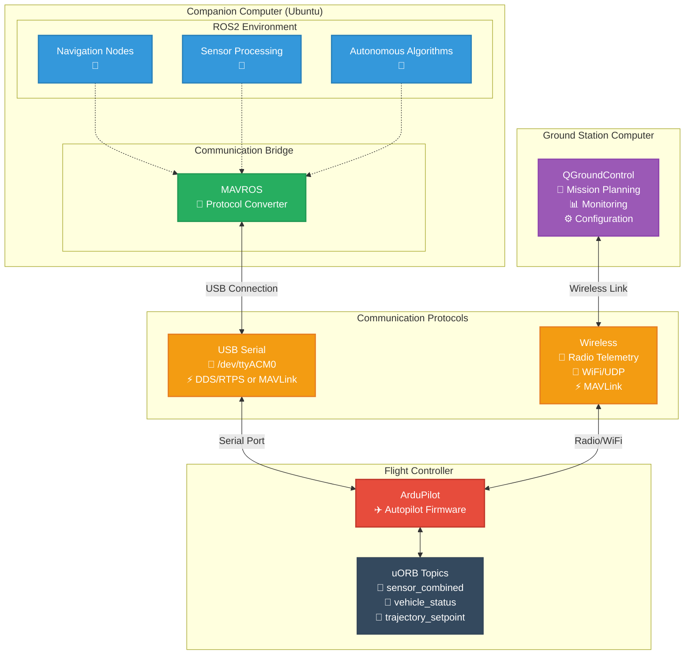

# All Applications

Ardupilot is the autopilot of the drone, and created using the `Dockerfile.ardupilot` docker file. Then
the swarm logic and control of the drone is handled by ROS2 and the ROS2 bridge over DDS, created by the `Dockerfile.ros2`
dockerfile. Final GroundControlStation is to monitor and do mission planning




## Netowrk Configuraiton

SERIAL1 → DDS communication (ArduPilot ↔ ROS2)
UDP → MAVLink for QGroundControl (ArduPilot ↔ QGC)
```
┌─────────────────┐    Serial     ┌─────────────────┐    DDS      ┌─────────────────┐
│   ArduPilot     │────SERIAL1────│   DDS Agent     │─────────────│     ROS2        │
│     SITL        │               │ MicroXRCEAgent  │             │   /ap/topics    │
│                 │               └─────────────────┘             └─────────────────┘
│                 │
│                 │    UDP        ┌─────────────────┐
│                 │────14550──────│ QGroundControl  │
└─────────────────┘               │   (MAVLink)     │
                                  └─────────────────┘
```

## Docker and Docker Compose

Make sure both are installed and working


Manual Testing
```bash
#Build the docker images and containers
bash start_swarm.sh -b
bash start_swarm.sh -n 4
# Wait a minute for startup, then check
sleep 60
./scripts/check_swarm_status.sh 4
```

## GroundControlStation

https://docs.qgroundcontrol.com/master/en/qgc-user-guide/getting_started/download_and_install.html

After the install, run using the following
```bash
chmod +x ./QGroundControl.AppImage
./QGroundControl.AppImage
```

# ArduPilot Swarm Debugging Guide

This guide documents common issues and debugging steps for the ArduPilot swarm system running in Docker containers.

## System Architecture Overview

The swarm system consists of:
- **Drone containers**: Run ArduPilot SITL instances
- **ROS2 bridge**: Handles MAVROS communication
- **Swarm controller**: Manages ROS2 nodes and launch files
- **Host Gazebo**: Provides physics simulation

## Common Issues and Solutions

### 1. Container Environment Variables Warnings

**Problem**: Docker Compose shows multiple warnings about undefined environment variables
```
WARN[0000] The "CONTAINER_NAME" variable is not set. Defaulting to a blank string.
```

**Root Cause**: Environment variables defined inside container bash scripts are parsed by Docker Compose

**Solution**: Move complex logic from Docker Compose YAML to standalone scripts
- Create `scripts/start_drone_container.sh`
- Create `scripts/start_swarm_controller.sh`
- Use `command: ["/path/to/script.sh"]` instead of inline bash

### 2. RMW Implementation Errors

**Problem**: Build fails with RMW implementation not found
```
Could not find ROS middleware implementation 'rmw_cyclonedds_cpp'
```

**Root Cause**: Incorrect RMW package name or missing installation

**Solutions**:
- **Fix package name**: `rmw_cyclonedds_cpp` (not `rmw_cyclonedds_cpp`)
- **Install both implementations** in Dockerfile:
  ```dockerfile
  RUN apt-get install -y \
      ros-humble-rmw-fastrtps-cpp \
      ros-humble-rmw-cyclonedds-cpp \
      ros-humble-rmw-implementation
  ```
- **Set correct environment**: `RMW_IMPLEMENTATION=rmw_cyclonedds_cpp`

### 3. Containers Exiting Immediately

**Problem**: Drone containers start but exit immediately
```
Error response from daemon: container is not running
```

**Root Cause**: Startup script completes and container exits

**Solution**: Modify startup script to keep container alive
```bash
# At end of startup script:
echo "Container ready. Keeping alive..."
tail -f /dev/null
```

### 4. ArduPilot SITL Crashes

**Problem**: SITL starts but immediately dies
```
WARNING: SITL process died. Restarting...
```

**Root Cause**: Missing Python dependencies (typically `matplotlib`)

**Solution**: Install missing dependencies
```dockerfile
RUN pip3 install --no-cache-dir -U \
    matplotlib numpy scipy \
    pymavlink mavproxy geopy dronekit
```

### 5. Volume Mounting Issues

**Problem**: ArduPilot not found despite being in Dockerfile
```
ERROR: ArduPilot not found at /root/ardu_ws/src/ardupilot/
```

**Root Cause**: Host volume mount overrides Docker image content

**Solution**: Mount only specific directories needed:
```yaml
volumes:
  - ./src/swarm_control:/root/ardu_ws/src/swarm_control:cached
  - ./src/custom_gz:/root/ardu_ws/src/custom_gz:cached
  # Don't mount entire ./src directory
```

## Debugging Workflow

### Step 1: Test Individual Containers

Test each component in isolation to identify the failure point.

#### Test ROS2 Bridge Container
```bash
# Start only ROS2 bridge
docker compose -f compose.yaml up ros2_bridge

# Inside container, test ROS2
docker exec -it ros2_bridge bash
source /opt/ros/humble/setup.bash
ros2 --version
ros2 topic list
```

**Expected**: ROS2 commands work without errors

#### Test Single Drone Container
```bash
# Start one drone
docker compose -f compose.yaml up --scale drone=1 drone

# Check if container stays running
docker ps | grep drone

# Enter container and check ArduPilot
docker exec -it swarm_ardupilot-drone-1 bash
ls -la /root/ardu_ws/src/ardupilot/
```

**Expected**: Container stays running, ArduPilot files exist

#### Test Swarm Controller
```bash
# Start swarm controller
docker compose -f compose.yaml up swarm_controller

# Check workspace build
docker exec -it swarm_controller bash
cd /root/ros2_ws
colcon build --packages-select swarm_control
```

**Expected**: ROS2 workspace builds successfully

### Step 2: Check System Status

Use the status script to check overall health:
```bash
./scripts/check_swarm_status.sh 4
```

**Interpret results**:
- ✅ **Container Status**: All containers show "Up"
- ✅ **Port Status**: MAVLink/ROS ports show "✓"
- ✅ **ROS2 Status**: Topics and nodes are visible
- ❌ **Connection Test**: All connections should succeed

### Step 3: Debug Container Issues

#### Check Container Logs
```bash
# View all logs
docker compose -f compose.yaml logs -f

# View specific container
docker compose -f compose.yaml logs -f drone
docker compose -f compose.yaml logs -f swarm_controller
```

#### Enter Containers for Manual Testing
```bash
# Enter drone container
docker exec -it swarm_ardupilot-drone-1 bash

# Check SITL logs
cat /root/logs/sitl_drone_1.log

# Test ArduPilot manually
cd /tmp/sitl_0
python3 /root/ardu_ws/src/ardupilot/Tools/autotest/sim_vehicle.py \
    --vehicle ArduCopter --model quad --console
```

#### Check Process Status
```bash
# Check if SITL is running
ps aux | grep -i ardu

# Check port availability
netstat -tuln | grep -E "14550|14560|14570|14580"

# Test port connectivity
nc -z localhost 14550 && echo "Port OK" || echo "Port FAIL"
```

### Step 4: Network and Communication Debug

#### Verify Docker Networking
```bash
# Check container network settings
docker inspect swarm_ardupilot-drone-1 | grep -A 10 "NetworkSettings"

# Test inter-container communication
docker exec -it swarm_controller bash
nc -z ros2_bridge 14550
```

#### Check ROS2 Communication
```bash
# Inside swarm_controller
source /opt/ros/humble/setup.bash
export RMW_IMPLEMENTATION=rmw_cyclonedds_cpp

# List topics
ros2 topic list

# Check for drone-related topics
ros2 topic list | grep -E "(drone|mavros|ap/)"

# Test topic publishing
ros2 topic echo /mavros/state
```

## Troubleshooting Commands Reference

### Container Management
```bash
# Stop all containers
docker compose -f compose.yaml down

# Rebuild specific container
docker compose -f compose.yaml build drone

# View container resource usage
docker stats

# Clean up dangling containers
docker system prune -f
```

### Log Monitoring
```bash
# Real-time logs
docker compose -f compose.yaml logs -f

# Filter for errors
docker compose -f compose.yaml logs | grep -i error

# Check specific timeframe
docker logs --since="5m" swarm_ardupilot-drone-1
```

### Port and Process Debugging
```bash
# Check all listening ports
netstat -tuln | grep LISTEN

# Find process using specific port
lsof -i :14550

# Kill stuck processes
pkill -f sim_vehicle
pkill -f arducopter
```

### File System Issues
```bash
# Check mounted volumes
docker exec -it container_name mount | grep ardu_ws

# Verify file permissions
docker exec -it container_name ls -la /root/ardu_ws/src/

# Check disk space
docker system df
```

## Performance Optimization

### Resource Allocation
- **CPU**: Allocate 2+ cores per drone container
- **Memory**: 2GB+ per drone for compilation
- **Disk**: Ensure sufficient space for build artifacts

### Container Startup Optimization
- **Stagger starts**: 15-second delays between drone instances
- **Pre-built images**: Keep ArduPilot compiled in Docker image
- **Persistent volumes**: Use named volumes for build cache

### Network Performance
- **Host networking**: Use `network_mode: host` for best performance
- **Port allocation**: Use 10-port spacing (14550, 14560, 14570...)
- **Localhost binding**: Use `127.0.0.1` for inter-container communication

## Recovery Procedures

### Complete System Reset
```bash
# Stop everything
docker compose -f compose.yaml down

# Clean containers and images
docker system prune -a

# Rebuild from scratch
docker compose -f compose.yaml build
bash start_swarm.sh -n 4
```

### Individual Container Recovery
```bash
# Restart single container
docker compose -f compose.yaml restart swarm_ardupilot-drone-1

# Replace failed container
docker compose -f compose.yaml up -d --force-recreate swarm_ardupilot-drone-1
```

### SITL Recovery
```bash
# Inside drone container
pkill -f sim_vehicle
cd /tmp/sitl_0
# Restart SITL manually with proper parameters
```

## Success Indicators

When the system is working correctly, you should see:

✅ **Container Status**: All containers show "Up" for 2+ minutes  
✅ **Build Success**: No compilation errors in logs  
✅ **Port Availability**: All MAVLink ports (14550, 14560, etc.) are listening  
✅ **SITL Output**: "ArduCopter ready" messages in logs  
✅ **ROS2 Topics**: `/mavros/state` and other topics visible  
✅ **Connections**: `nc -z localhost 14550` succeeds  
✅ **No Crashes**: No "process died" messages in logs  

## Common Error Patterns

| Error Message | Likely Cause | Solution |
|---------------|--------------|----------|
| `container is not running` | Script exits immediately | Add `tail -f /dev/null` to script |
| `ModuleNotFoundError: matplotlib` | Missing Python deps | Install in Dockerfile |
| `Could not find ROS middleware` | Wrong RMW name | Use `rmw_cyclonedds_cpp` |
| `ArduPilot not found` | Volume mount override | Mount specific dirs only |
| `Port already in use` | Previous instance running | `pkill -f sim_vehicle` |
| `No topics found` | RMW mismatch | Set same RMW in all containers |